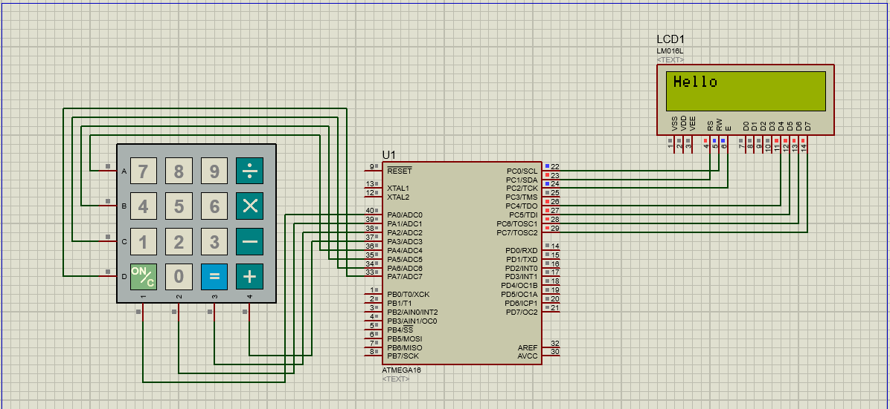
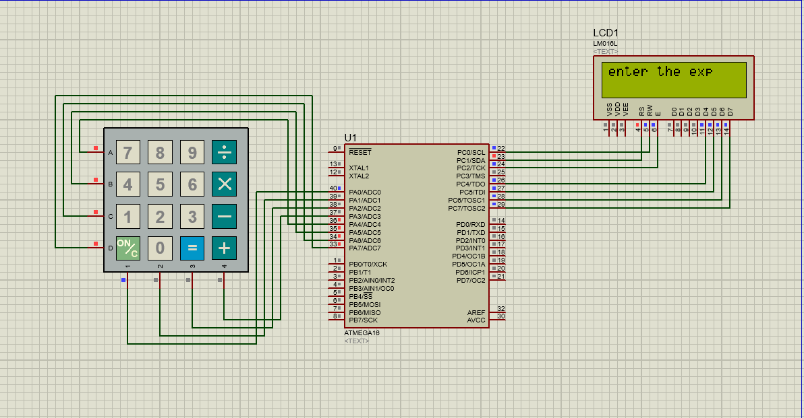

## Calculatorproject
 Simple calculator project with Atmega16

# Project Components:
* Atmega16
* LCD 16*2
* KEYPAD 4*4

# Project Operations:
* ADD
* SUB
* MUL
* DIV

# Project Scnario:
1. Hello screen is appeared.

2. system is waiting for on button to be pressed to start receiving expresions.

3. expressions example:

# Project software:
- all drivers are implemented from scratch(KEYPAD, LCD).
- calculator expression evaluation:
    * Linked list.
    * Stack.
    * Expression evaluation logic.
